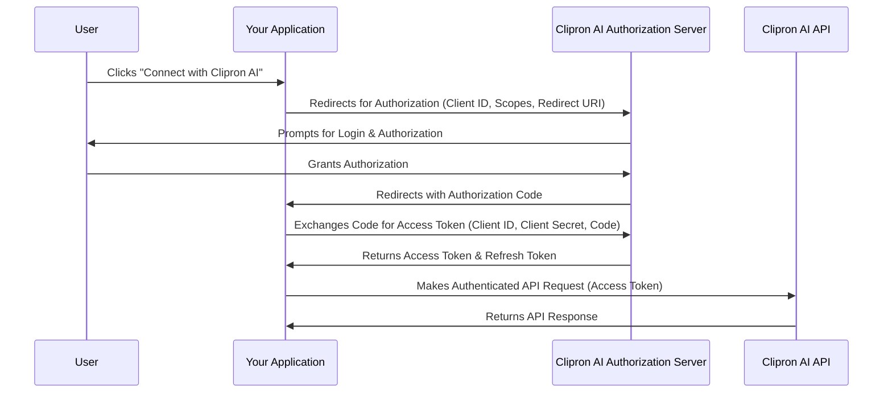

# OAuth 2.0

OAuth 2.0 is an industry-standard protocol for authorization. It allows a third-party application to obtain limited access to a user's resources on the Clipron AI platform without exposing their credentials.

## How OAuth 2.0 Works with Clipron AI

The typical OAuth 2.0 flow for web applications involves the following steps:

1.  **Authorization Request:** Your application redirects the user to the Clipron AI authorization server.
    *   The request includes your client ID, redirect URI, requested scopes (permissions), and a state parameter for security.
2.  **User Authorization:** The user is prompted to log in to their Clipron AI account (if not already logged in) and grant your application the requested permissions.
3.  **Authorization Grant:** Upon successful authorization, Clipron AI redirects the user back to your application's specified redirect URI, including an authorization code.
4.  **Access Token Request:** Your application exchanges the authorization code for an access token (and optionally a refresh token) by making a server-to-server request to the Clipron AI token endpoint. This request includes your client ID and client secret for authentication.
5.  **Access Token Usage:** Your application uses the obtained access token to make authenticated API requests to Clipron AI on behalf of the user.
6.  **Refresh Token (Optional):** If a refresh token is issued, your application can use it to obtain new access tokens when the current one expires, without requiring the user to re-authorize.

## Key OAuth Concepts

*   **Client ID:** A public identifier for your application.
*   **Client Secret:** A confidential secret known only to your application and the Clipron AI authorization server. Keep this secure!
*   **Redirect URI:** The URI where the user is redirected after authorizing your application. Must be pre-registered with Clipron AI.
*   **Scopes:** Define the specific permissions your application requests (e.g., `read:analysis`, `write:project`).
*   **Access Token:** A credential that grants access to specific resources. It has a limited lifespan.
*   **Refresh Token:** A long-lived credential used to obtain new access tokens without user interaction.

## Registering Your Application

Before using OAuth, you must register your application with Clipron AI to obtain a Client ID and Client Secret. This process typically involves:

1.  Logging into your Clipron AI dashboard.
2.  Navigating to "Developer Settings" or "API Integrations."
3.  Creating a new OAuth application and configuring its details, including redirect URIs and scopes.

## Example Flow (Conceptual)

## Security Best Practices

*   **Keep Client Secret Confidential:** Never expose your client secret in client-side code.
*   **Validate State Parameter:** Use the `state` parameter to prevent Cross-Site Request Forgery (CSRF) attacks.
*   **Use HTTPS:** Always use HTTPS for all OAuth-related communications.
*   **Request Minimal Scopes:** Only request the permissions your application absolutely needs.
*   **Securely Store Tokens:** Store access and refresh tokens securely.
