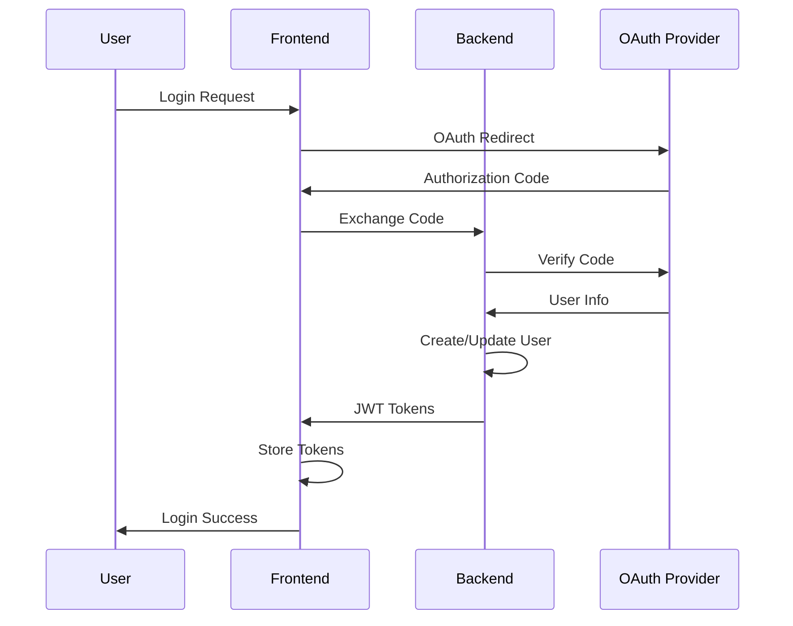
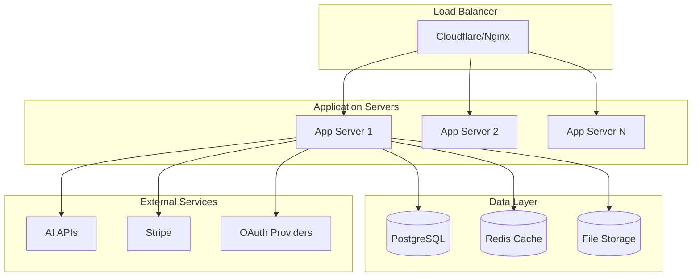

# Architecture Overview

Clipron AI is built as a modern, scalable full-stack application designed for high-performance code security analysis. This document provides a comprehensive overview of the system architecture, components, and design decisions.

## System Architecture


### High-Level Components

<CardGroup cols={2}>
  <Card title="Frontend Layer" icon="browser">
    **React 18 SPA**
    - Modern React with hooks and functional components
    - Tailwind CSS for responsive design
    - Real-time updates and notifications
  </Card>
  <Card title="API Gateway" icon="globe">
    **Nginx Reverse Proxy**
    - Load balancing and SSL termination
    - Static file serving
    - Request routing and caching
  </Card>
  <Card title="Backend Services" icon="server">
    **FastAPI Application**
    - Asynchronous Python backend
    - RESTful API design
    - JWT authentication and authorization
  </Card>
  <Card title="AI Processing" icon="brain">
    **Ron Cortex Engine**
    - Multi-model AI orchestration
    - Intelligent routing and cost optimization
    - Advanced security analysis algorithms
  </Card>
</CardGroup>

## Architectural Patterns

### Microservices-Ready Monolith

Clipron AI follows a "microservices-ready monolith" pattern:

<AccordionGroup>
  <Accordion title="Modular Design">
    **Clear separation of concerns**
    - Authentication module
    - Analysis engine module
    - Payment processing module
    - User management module
    - Integration services module
  </Accordion>
  
  <Accordion title="Service Boundaries">
    **Well-defined interfaces**
    - Each module has clear APIs
    - Minimal cross-module dependencies
    - Easy to extract into separate services
  </Accordion>
  
  <Accordion title="Shared Infrastructure">
    **Common components**
    - Database layer
    - Authentication middleware
    - Logging and monitoring
    - Configuration management
  </Accordion>
</AccordionGroup>

### Event-Driven Architecture

<Tabs>
  <Tab title="Analysis Pipeline">
    ```mermaid
    graph TD
        A[Code Input] --> B[Preprocessing]
        B --> C[AI Model Selection]
        C --> D[Analysis Execution]
        D --> E[Result Processing]
        E --> F[Report Generation]
        F --> G[Notification]
    ```
  </Tab>
  
  <Tab title="User Actions">
    ```mermaid
    graph TD
        A[User Action] --> B[Authentication Check]
        B --> C[Authorization Check]
        C --> D[Business Logic]
        D --> E[Database Update]
        E --> F[Event Emission]
        F --> G[Side Effects]
    ```
  </Tab>
  
  <Tab title="Payment Flow">
    ```mermaid
    graph TD
        A[Payment Intent] --> B[Stripe Processing]
        B --> C[Webhook Received]
        C --> D[Credit Update]
        D --> E[User Notification]
        E --> F[Analytics Update]
    ```
  </Tab>
</Tabs>

## Technology Stack

### Frontend Technologies

<CardGroup cols={3}>
  <Card title="Core Framework" icon="react">
    **React 18**
    - Functional components with hooks
    - Context API for state management
    - Suspense for code splitting
  </Card>
  <Card title="Styling" icon="palette">
    **Tailwind CSS**
    - Utility-first CSS framework
    - Responsive design system
    - Dark mode support
  </Card>
  <Card title="Build Tools" icon="tools">
    **Create React App**
    - Webpack bundling
    - Hot module replacement
    - Production optimization
  </Card>
  <Card title="HTTP Client" icon="network">
    **Axios**
    - Promise-based HTTP client
    - Request/response interceptors
    - Automatic JSON handling
  </Card>
  <Card title="Routing" icon="route">
    **React Router**
    - Client-side routing
    - Protected routes
    - Dynamic route parameters
  </Card>
  <Card title="Icons" icon="star">
    **Heroicons**
    - Consistent icon library
    - SVG-based icons
    - Multiple styles available
  </Card>
</CardGroup>

### Backend Technologies

<CardGroup cols={3}>
  <Card title="Web Framework" icon="server">
    **FastAPI**
    - High-performance async framework
    - Automatic API documentation
    - Type hints and validation
  </Card>
  <Card title="Database ORM" icon="database">
    **SQLAlchemy**
    - Object-relational mapping
    - Database migrations with Alembic
    - Connection pooling
  </Card>
  <Card title="Authentication" icon="shield-check">
    **JWT + OAuth**
    - JSON Web Tokens
    - Google and GitHub OAuth
    - Role-based access control
  </Card>
  <Card title="Task Queue" icon="queue">
    **Celery (Optional)**
    - Asynchronous task processing
    - Redis as message broker
    - Scheduled tasks support
  </Card>
  <Card title="Validation" icon="check-circle">
    **Pydantic**
    - Data validation and serialization
    - Type safety
    - Automatic documentation
  </Card>
  <Card title="HTTP Server" icon="globe">
    **Uvicorn**
    - ASGI server implementation
    - High-performance async handling
    - WebSocket support
  </Card>
</CardGroup>

## Data Architecture

### Database Design

<AccordionGroup>
  <Accordion title="Core Entities">
    **Primary data models**
    - **Users**: Authentication and profile data
    - **Analyses**: Security analysis records
    - **Credits**: Payment and usage tracking
    - **Repositories**: GitHub integration data
    - **API Keys**: External service credentials
  </Accordion>
  
  <Accordion title="Relationship Patterns">
    **Entity relationships**
    - One-to-many: User → Analyses
    - One-to-many: User → Repositories
    - Many-to-many: Users ↔ Organizations (future)
    - One-to-one: User → Credit Balance
  </Accordion>
  
  <Accordion title="Data Partitioning">
    **Scalability considerations**
    - Analysis results partitioned by date
    - User data sharded by region (future)
    - Audit logs in separate tables
    - File uploads in object storage
  </Accordion>
</AccordionGroup>

### Caching Strategy

<Tabs>
  <Tab title="Application Cache">
    **In-memory caching**
    - User session data
    - API response caching
    - Configuration settings
    - Frequently accessed data
  </Tab>
  
  <Tab title="Redis Cache">
    **Distributed caching**
    - Analysis results (temporary)
    - Rate limiting counters
    - Session storage
    - Real-time notifications
  </Tab>
  
  <Tab title="CDN Cache">
    **Content delivery**
    - Static assets (CSS, JS, images)
    - API responses (with TTL)
    - Documentation pages
    - Public analysis reports
  </Tab>
</Tabs>

## Security Architecture

### Defense in Depth

<CardGroup cols={2}>
  <Card title="Network Security" icon="shield">
    - HTTPS/TLS encryption
    - Firewall configuration
    - DDoS protection via Cloudflare
    - VPN access for admin functions
  </Card>
  <Card title="Application Security" icon="lock">
    - JWT token authentication
    - Role-based authorization
    - Input validation and sanitization
    - SQL injection prevention
  </Card>
  <Card title="Data Security" icon="database">
    - Encryption at rest
    - Encrypted database connections
    - PII data anonymization
    - Secure backup procedures
  </Card>
  <Card title="API Security" icon="key">
    - Rate limiting
    - API key rotation
    - Request signing
    - Audit logging
  </Card>
</CardGroup>

### Authentication Flow



## Scalability Design

### Horizontal Scaling

<AccordionGroup>
  <Accordion title="Stateless Services">
    **Scalable backend design**
    - No server-side session storage
    - JWT tokens for authentication
    - Database for persistent state
    - External APIs for AI processing
  </Accordion>
  
  <Accordion title="Load Balancing">
    **Traffic distribution**
    - Nginx load balancer
    - Round-robin algorithm
    - Health check endpoints
    - Session affinity not required
  </Accordion>
  
  <Accordion title="Database Scaling">
    **Data layer scaling**
    - Read replicas for queries
    - Connection pooling
    - Query optimization
    - Caching frequently accessed data
  </Accordion>
</AccordionGroup>

### Performance Optimization

<Tabs>
  <Tab title="Frontend Optimization">
    - Code splitting and lazy loading
    - Image optimization and compression
    - Bundle size optimization
    - Service worker for caching
  </Tab>
  
  <Tab title="Backend Optimization">
    - Async/await for I/O operations
    - Database query optimization
    - Response compression
    - Connection pooling
  </Tab>
  
  <Tab title="AI Processing">
    - Model selection optimization
    - Request batching
    - Result caching
    - Cost-aware routing
  </Tab>
</Tabs>

## Monitoring and Observability

### Three Pillars of Observability

<CardGroup cols={3}>
  <Card title="Metrics" icon="chart-line">
    **Quantitative measurements**
    - Response times
    - Error rates
    - Throughput
    - Resource utilization
  </Card>
  <Card title="Logs" icon="file-text">
    **Event records**
    - Application logs
    - Access logs
    - Error logs
    - Audit trails
  </Card>
  <Card title="Traces" icon="route">
    **Request flows**
    - Distributed tracing
    - Performance bottlenecks
    - Error propagation
    - Service dependencies
  </Card>
</CardGroup>

### Monitoring Stack

<AccordionGroup>
  <Accordion title="Application Monitoring">
    **Sentry Integration**
    - Error tracking and alerting
    - Performance monitoring
    - Release tracking
    - User feedback collection
  </Accordion>
  
  <Accordion title="Infrastructure Monitoring">
    **System metrics**
    - CPU, memory, disk usage
    - Network performance
    - Database performance
    - Service health checks
  </Accordion>
  
  <Accordion title="Business Metrics">
    **KPI tracking**
    - User registrations
    - Analysis volume
    - Revenue metrics
    - Feature usage
  </Accordion>
</AccordionGroup>

## Deployment Architecture

### Production Environment



### Deployment Strategies

<Tabs>
  <Tab title="Blue-Green Deployment">
    - Two identical production environments
    - Switch traffic between environments
    - Zero-downtime deployments
    - Easy rollback capability
  </Tab>
  
  <Tab title="Rolling Deployment">
    - Gradual replacement of instances
    - Maintains service availability
    - Lower resource requirements
    - Built-in health checks
  </Tab>
  
  <Tab title="Canary Deployment">
    - Deploy to subset of users
    - Monitor metrics and feedback
    - Gradual traffic increase
    - Risk mitigation strategy
  </Tab>
</Tabs>

<Tip>
  **Architecture Tip**: The modular design allows for easy extraction of components into microservices as the system scales. Start with the monolith and split services based on actual usage patterns and bottlenecks.
</Tip>
