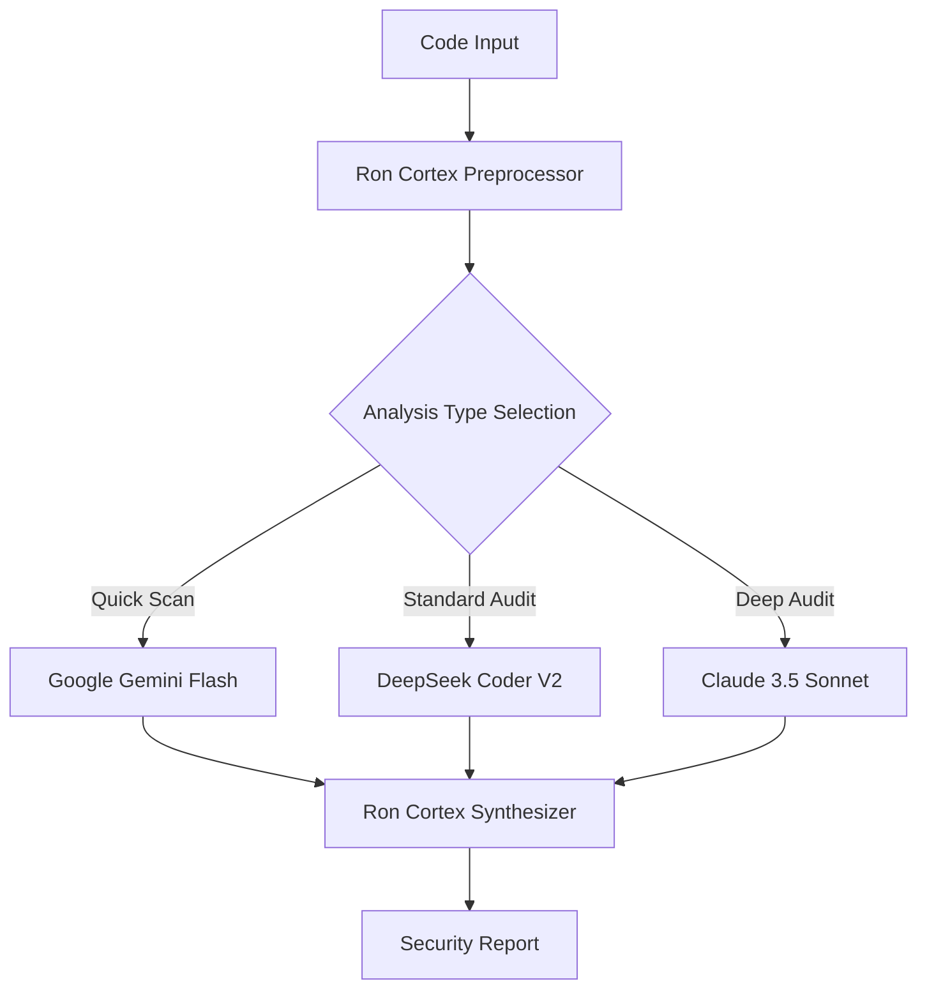

# Philosophy & Core Concepts

## Quantum-Level Depth Analysis

**Quantum-Level Depth** doesn't refer to literal quantum computing. It's a metaphor for our analytical approach inspired by complex systems principles. Unlike linear scanners that look for known patterns (A leads to B), our engine models code as a system with emergent properties.

<Info>
  Our analysis examines how seemingly unrelated code parts can interact to create unexpected, complex vulnerabilities that traditional analysis would miss.
</Info>

### Key Principles

<AccordionGroup>
  <Accordion title="Emergent Properties Analysis">
    We analyze how individual code components combine to create system-wide behaviors that may introduce vulnerabilities not present in isolated components.
  </Accordion>
  
  <Accordion title="Probabilistic Modeling">
    Uses probabilistic and heuristic models to identify potential vulnerability "states" that traditional analysis might overlook.
  </Accordion>
  
  <Accordion title="Non-Linear Code Relationships">
    Examines complex interdependencies between code sections, even when there's no direct calling relationship.
  </Accordion>
</AccordionGroup>

## Ron Cortex AI Engine 2.0

This is the brain of the entire operation. It's not a single model, but an **orchestration and analytical layer** that sits above the base AI models.

### Core Functions

<CardGroup cols={2}>
  <Card title="Code Preprocessing" icon="gear">
    Divides code into logical units, abstractions, and creates contextual dependency graphs
  </Card>
  <Card title="Intelligent Routing" icon="route">
    Selects the most suitable and cost-effective AI model based on analysis type and code characteristics
  </Card>
  <Card title="Synthesis & Scoring" icon="calculator">
    Aggregates results from AI models, removes false positives using proprietary heuristics
  </Card>
  <Card title="Report Generation" icon="document-text">
    Converts technical outputs into understandable, actionable reports with fix recommendations
  </Card>
</CardGroup>

## Narrative Theory of Cybernetic Threats

At Clipron AI, we believe every vulnerability tells a story. It's a story about how an attacker can penetrate a system. Traditional tools see only individual "words" (lines of code) or "sentences" (functions). We read the entire **narrative**.

### Narrative Elements

<Tabs>
  <Tab title="Non-Linear Storytelling">
    Attacks rarely follow a direct path. Our engine analyzes code non-linearly, similar to a modern novel with flashbacks and parallel storylines. It examines how a function defined at the beginning can affect a variable at the end, even without direct calling.
  </Tab>
  
  <Tab title="Unreliable Narrator">
    Code can "lie". Comments may be outdated, variable names misleading. Our system approaches code as an "unreliable narrator" and verifies its claims against actual behavior and data flows.
  </Tab>
  
  <Tab title="Threat Archetypes">
    We identify recurring vulnerability patterns as "archetypes" (e.g., "Hero with Leaky Shield" for insufficient input validation, "Trojan Horse" for hidden dependencies). This allows us not only to detect but also classify threats and provide more targeted fixes.
  </Tab>
</Tabs>

## Behavioral Analysis & Predictive Modeling

Our engine doesn't rely solely on signature-based detection. It uses **behavioral analysis** where:

1. **Baseline Creation**: Creates a baseline of normal behavior and data flows in the code
2. **Anomaly Detection**: Looks for anomalies and deviations from this baseline that may indicate vulnerabilities
3. **Predictive Models**: Uses predictive models trained on massive datasets of open-source code and known vulnerabilities

<Warning>
  This approach, combining technical precision with cognitive and narrative models, allows us to see deeper and protect more effectively.
</Warning>

## Technical Implementation

### Multi-Model Architecture

### Cost Optimization

- **Smart Cost Estimation**: Estimates token count based on code size and complexity before analysis
- **Robust Fallback**: Automatically redirects to next best model if primary model is unavailable
- **Intelligent Caching**: Caches analysis results for similar code patterns to reduce costs

## Why This Matters

Traditional security tools often miss sophisticated attacks because they:
- Focus on known vulnerability signatures
- Analyze code in isolation
- Miss emergent behaviors from component interactions
- Can't predict novel attack vectors

Our approach addresses these limitations by treating code security as a complex, narrative-driven system where the whole is greater than the sum of its parts.
